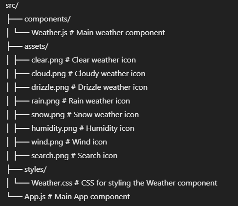

# React Weather App

This project is a simple **Weather Application** built using **React.js**.  
It allows users to search for weather information for any city and displays temperature,  
humidity, wind speed, and weather conditions using icons.  
The app uses the **OpenWeatherMap API** for fetching weather data.

---

## Table of Contents

1. [Features](#features)  
2. [Technologies Used](#technologies-used)  
3. [Project Structure](#project-structure)  
4. [Installation and Setup](#installation-and-setup)  
5. [Environment Variables](#environment-variables)  
6. [How It Works](#how-it-works)  
7. [Available Scripts](#available-scripts)  
8. [License](#license)

---

## Features

- Search weather data by city name.  
- Displays:  
  - Current temperature.  
  - Humidity percentage.  
  - Wind speed.  
  - Weather condition represented by dynamic icons.  
- Default weather display for London on initial load.

---

## Technologies Used

- **React.js**: Front-end library for building user interfaces.  
- **CSS**: For styling the app.  
- **OpenWeatherMap API**: For fetching real-time weather data.

---

## Project Structure

---

## Environment Variables

- The application requires an API key from OpenWeatherMap.
- Add your API key in the .env file under the variable VITE_APP_ID.

---

# How It Works

## 1.Fetching Weather Data:

- The search function sends an asynchronous request to the OpenWeatherMap API with the city name and the API key.
On success, it parses the response and extracts relevant data: temperature, humidity, wind speed, location, and the weather icon.

## 2.Dynamic Icons:

- A mapping (allIcons) of OpenWeatherMap's weather codes to locally stored icons is used to display the appropriate weather condition.

## 3.User Interaction:

- Users can type a city name in the search bar.
Clicking the search icon fetches and displays the weather data.
Default Weather:

- The app fetches and displays the weather for London upon loading.